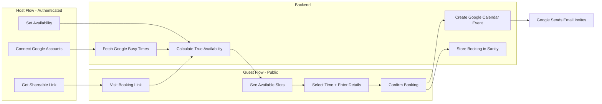
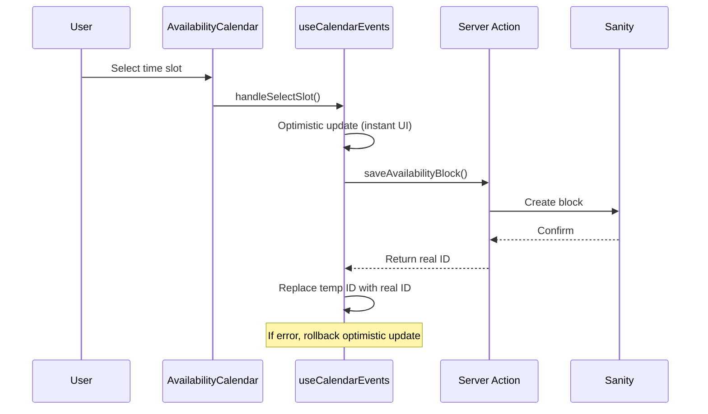

# Calendly Clone with Google Calendar Integration

---

## ⚠️ Development Rules (MUST FOLLOW)

### TypeGen & GROQ Queries

1. **NEVER write inline GROQ queries** - All queries must use `defineQuery` from `next-sanity`
2. **All queries go in `sanity/queries/`** - Organized by domain (users.ts, bookings.ts, etc.)
3. **Query naming convention**: Use `SCREAMING_SNAKE_CASE` (e.g., `USER_BY_CLERK_ID_QUERY`)
4. **Run `pnpm run typegen`** after ANY schema or query changes
5. **Use generated types** - Never manually define Sanity types
6. **NO barrel exports (index.ts re-exports)** - Import directly from source files

### Query Organization

```
sanity/queries/
├── users.ts      # User-related queries + derived types
└── bookings.ts   # Booking-related queries + derived types
```

### Usage Pattern

```typescript
// ✅ CORRECT - Use defineQuery in queries folder
// sanity/queries/users.ts
export const USER_BY_CLERK_ID_QUERY = defineQuery(`*[
  _type == "user"
  && clerkId == $clerkId
][0]{ _id, name, email }`);

// ✅ CORRECT - Import directly from source file
import { USER_BY_CLERK_ID_QUERY } from "@/sanity/queries/users";
const user = await client.fetch(USER_BY_CLERK_ID_QUERY, { clerkId });

// ❌ WRONG - Barrel export
import { USER_BY_CLERK_ID_QUERY } from "@/sanity/queries";

// ❌ WRONG - Inline query
const user = await client.fetch(`*[_type == "user" && clerkId == $clerkId][0]`);

// ❌ WRONG - Manual type definition
interface User { _id: string; name: string; }
```

### Type Derivation

**ALWAYS use generated types** - never manually define Sanity types.

Query files (`sanity/queries/*.ts`) are the ONLY place that imports from `@/sanity/types`.

Application code imports derived types from query files.

```typescript
// sanity/queries/users.ts
import type { USER_WITH_TOKENS_QUERYResult } from "@/sanity/types"; // ✅ OK in query files

// ✅ CORRECT - Derive from generated type
export type ConnectedAccountWithTokens = NonNullable<
  NonNullable<USER_WITH_TOKENS_QUERYResult>["connectedAccounts"]
>[number];

// ❌ WRONG - Manual type definition
export type ConnectedAccountWithTokens = {
  _key: string;
  accountId: string;
  // ...
};

// Application code:
import { type ConnectedAccountWithTokens } from "@/sanity/queries/users"; // ✅
import type { USER_WITH_TOKENS_QUERYResult } from "@/sanity/types"; // ❌ Don't do this in app code
```

### Scripts

```bash
pnpm run typegen   # Extract schema + generate types
pnpm run typecheck # Verify TypeScript compiles
```

---

## User Flow Overview



---

## Phase 1: Sanity Setup

### -> completed already...

---

## Phase 2: Availability Calendar with Sanity Persistence

The existing calendar in `components/calendar/` needs to save time blocks to Sanity with optimistic UI updates.

### 2.1 Architecture



### 2.2 Server Actions for Availability

File: `lib/actions/availability.ts`

Note: No `revalidatePath` - using Sanity Live for real-time updates instead.

```typescript
'use server'

import { auth } from '@clerk/nextjs/server';
import { writeClient } from '@/sanity/lib/writeClient';
import { client } from '@/sanity/lib/client';
import { USER_ID_BY_CLERK_ID_QUERY, USER_WITH_AVAILABILITY_QUERY } from '@/sanity/queries';

export async function saveAvailabilityBlock(block: {
  tempId: string;
  start: Date;
  end: Date;
}): Promise<{ tempId: string; realKey: string }> {
  const { userId } = await auth();
  if (!userId) throw new Error('Unauthorized');
  
  const user = await getOrCreateUser(userId);
  const blockKey = crypto.randomUUID();
  
  await writeClient
    .patch(user._id)
    .setIfMissing({ availability: [] })
    .append('availability', [{
      _key: blockKey,
      startDateTime: block.start.toISOString(),
      endDateTime: block.end.toISOString(),
    }])
    .commit();
  
  return { tempId: block.tempId, realKey: blockKey };
}

export async function deleteAvailabilityBlock(blockKey: string): Promise<void> {
  // Remove block from user's availability array
}

export async function updateAvailabilityBlock(block: {
  key: string;
  start: Date;
  end: Date;
}): Promise<void> {
  // Update startDateTime and endDateTime for the block
}

export async function getAvailability() {
  const { userId } = await auth();
  if (!userId) return [];
  
  // Uses typed query - returns USER_WITH_AVAILABILITY_QUERYResult
  const user = await client.fetch(USER_WITH_AVAILABILITY_QUERY, { clerkId: userId });
  return user?.availability ?? [];
}
```

### 2.3 Updated useCalendarEvents Hook

File: `components/calendar/hooks/use-calendar-events.ts`

```typescript
'use client'

import { useState, useOptimistic, useTransition } from 'react';
import { 
  saveAvailabilityBlock, 
  deleteAvailabilityBlock,
  updateAvailabilityBlock 
} from '@/lib/actions/availability';

export function useCalendarEvents(initialBlocks: TimeBlock[] = []) {
  const [events, setEvents] = useState<TimeBlock[]>(initialBlocks);
  const [isPending, startTransition] = useTransition();
  
  // Optimistic state for instant UI feedback
  const [optimisticEvents, addOptimistic] = useOptimistic(
    events,
    (state, action: { type: 'add' | 'remove' | 'update'; block: TimeBlock }) => {
      switch (action.type) {
        case 'add':
          return mergeOverlappingBlocks([...state, action.block]);
        case 'remove':
          return state.filter(b => b.id !== action.block.id);
        case 'update':
          return mergeOverlappingBlocks(
            state.map(b => b.id === action.block.id ? action.block : b)
          );
        default:
          return state;
      }
    }
  );

  const addBlock = async (start: Date, end: Date) => {
    const tempId = `temp-${crypto.randomUUID()}`;
    const block: TimeBlock = { id: tempId, start, end };
    
    // Optimistic update - instant UI feedback
    startTransition(() => {
      addOptimistic({ type: 'add', block });
    });
    
    // Persist to Sanity
    try {
      const { realId } = await saveAvailabilityBlock({ tempId, start, end });
      // Replace temp ID with real ID
      setEvents(prev => prev.map(b => 
        b.id === tempId ? { ...b, id: realId } : b
      ));
    } catch (error) {
      // Rollback on error
      setEvents(prev => prev.filter(b => b.id !== tempId));
      console.error('Failed to save block:', error);
    }
  };

  const removeBlock = async (id: string) => {
    const block = events.find(b => b.id === id);
    if (!block) return;
    
    // Optimistic update
    startTransition(() => {
      addOptimistic({ type: 'remove', block });
    });
    
    try {
      await deleteAvailabilityBlock(id);
      setEvents(prev => prev.filter(b => b.id !== id));
    } catch (error) {
      // Rollback on error
      setEvents(prev => [...prev, block]);
      console.error('Failed to delete block:', error);
    }
  };

  // Similar pattern for updateBlock, copyDayToWeek, etc.
  
  return {
    events: optimisticEvents,
    isPending,
    addBlock,
    removeBlock,
    // ... rest of the API
  };
}
```

### 2.4 Loading Initial Data

File: `app/availability/page.tsx`

```typescript
import { getAvailability } from '@/lib/actions/availability';
import { AvailabilityCalendar } from '@/components/calendar';

export default async function AvailabilityPage() {
  const availability = await getAvailability();
  
  // Transform Sanity data to TimeBlock format
  const initialBlocks = availability.map(slot => ({
    id: slot._key,
    start: new Date(slot.startDateTime),
    end: new Date(slot.endDateTime),
  }));
  
  return (
    <div className="container py-8">
      <h1 className="text-2xl font-bold mb-6">Set Your Availability</h1>
      <AvailabilityCalendar initialBlocks={initialBlocks} />
    </div>
  );
}
```

---

## Phase 3: Sanity Schemas

### 3.1 User Schema (Host)

Note: The `availability` field stores specific date/time blocks that are saved from the calendar.

File: `sanity/schemaTypes/userType.ts`

```typescript
export const userType = defineType({
  name: "user",
  type: "document",
  fields: [
    defineField({ name: "clerkId", type: "string" }),
    defineField({ name: "name", type: "string" }),
    defineField({ name: "email", type: "string" }),
    defineField({ name: "slug", type: "slug", options: { source: "name" } }),
    defineField({
      name: "connectedAccounts",
      type: "array",
      of: [defineArrayMember({ type: "connectedAccount" })],
    }),
    defineField({
      name: "availability",
      type: "array",
      of: [defineArrayMember({ type: "availabilitySlot" })],
      description: "Specific date/time blocks when the user is available",
    }),
  ],
});
```

### 3.2 Availability Slot Schema

File: `sanity/schemaTypes/availabilitySlotType.ts`

Simplified to just use datetime fields (no redundant dayOfWeek/startTime/endTime):

```typescript
export const availabilitySlotType = defineType({
  name: "availabilitySlot",
  type: "object",
  icon: ClockIcon,
  fields: [
    defineField({
      name: "startDateTime",
      title: "Start",
      type: "datetime",
      validation: (Rule) => Rule.required(),
    }),
    defineField({
      name: "endDateTime",
      title: "End",
      type: "datetime",
      validation: (Rule) => Rule.required(),
    }),
  ],
  preview: {
    select: { start: "startDateTime", end: "endDateTime" },
    prepare({ start, end }) {
      // Shows: "Mon, Jan 6" with subtitle "9:00 AM - 5:00 PM"
    },
  },
});
```

### 3.3 Connected Account Schema

File: `sanity/schemaTypes/connectedAccountType.ts`

(Same as before - stores OAuth tokens for each Google account)

### 3.4 Booking Schema

File: `sanity/schemaTypes/bookingType.ts`

```typescript
export const bookingType = defineType({
  name: "booking",
  type: "document",
  fields: [
    defineField({ name: "host", type: "reference", to: [{ type: "user" }] }),
    defineField({ name: "guestName", type: "string" }),
    defineField({ name: "guestEmail", type: "string" }),
    defineField({ name: "startTime", type: "datetime" }),
    defineField({ name: "endTime", type: "datetime" }),
    defineField({ name: "googleEventId", type: "string" }),
    defineField({
      name: "status",
      type: "string",
      options: { list: ["confirmed", "cancelled"], layout: "radio" },
      initialValue: "confirmed",
    }),
    defineField({ name: "notes", type: "text" }),
  ],
});
```

---

## Phase 4: Google Cloud Setup

### 4.1 Google Cloud Console

- Create a new Google Cloud Project
- Enable Google Calendar API
- Configure OAuth consent screen (External, limited scopes)
- Create OAuth 2.0 credentials (Web application type)
- Add authorized redirect URI: `http://localhost:3000/api/calendar/callback`

### 4.2 Install googleapis

```bash
pnpm add googleapis
```

---

## Phase 5: OAuth Flow (Route Handlers)

### 5.1 OAuth Initiation

File: `app/api/calendar/connect/route.ts`

### 5.2 OAuth Callback

File: `app/api/calendar/callback/route.ts`

(Same as before - handles Google OAuth, stores tokens in Sanity)

---

## Phase 6: Server Actions

File: `lib/actions/calendar.ts`

```typescript
'use server'

// ============ HOST ACTIONS (Authenticated) ============

// Fetch busy times from all connected Google accounts
export async function getGoogleBusyTimes(startDate: Date, endDate: Date) {
  const { userId } = await auth();
  if (!userId) throw new Error('Unauthorized');
  
  const user = await getUserFromSanity(userId);
  const busySlots = [];
  
  for (const account of user.connectedAccounts ?? []) {
    const client = await getCalendarClient(account);
    const { data } = await client.events.list({
      calendarId: 'primary',
      timeMin: startDate.toISOString(),
      timeMax: endDate.toISOString(),
      singleEvents: true,
    });
    
    busySlots.push(...(data.items ?? []).map(e => ({
      start: e.start?.dateTime,
      end: e.end?.dateTime,
    })));
  }
  
  return busySlots;
}

// Save host's weekly availability
export async function saveAvailability(slots: AvailabilitySlot[]) {
  const { userId } = await auth();
  if (!userId) throw new Error('Unauthorized');
  
  // Update user's availability in Sanity
  
  revalidatePath('/availability');
}

// Disconnect Google account
export async function disconnectGoogleAccount(accountId: string) { ... }

// Set default calendar
export async function setDefaultCalendarAccount(accountId: string) { ... }
```

File: `lib/actions/booking.ts`

```typescript
'use server'

// ============ PUBLIC BOOKING ACTIONS (No auth required) ============

// Get available slots for a host (called from public booking page)
export async function getAvailableSlots(hostSlug: string, date: Date) {
  const host = await getHostBySlug(hostSlug);
  if (!host) throw new Error('Host not found');
  
  // 1. Get host's weekly availability for this day of week
  const dayOfWeek = date.getDay();
  const availabilityForDay = host.availability?.filter(
    slot => slot.dayOfWeek === dayOfWeek
  );
  
  // 2. Get existing bookings for this date
  const existingBookings = await getBookingsForDate(host._id, date);
  
  // 3. Get Google Calendar busy times
  const busyTimes = await getHostGoogleBusyTimes(host, date);
  
  // 4. Calculate available slots (availability - busy - booked)
  return calculateAvailableSlots(availabilityForDay, existingBookings, busyTimes);
}

// Create a booking (called from public booking page)
export async function createBooking(data: {
  hostSlug: string;
  startTime: Date;
  endTime: Date;
  guestName: string;
  guestEmail: string;
  notes?: string;
}) {
  const host = await getHostBySlug(data.hostSlug);
  if (!host) throw new Error('Host not found');
  
  // 1. Verify slot is still available (prevent race conditions)
  const isAvailable = await checkSlotAvailable(host, data.startTime, data.endTime);
  if (!isAvailable) throw new Error('Slot no longer available');
  
  // 2. Create Google Calendar event
  const account = getDefaultAccount(host.connectedAccounts);
  const client = await getCalendarClient(account);
  
  const googleEvent = await client.events.insert({
    calendarId: 'primary',
    sendUpdates: 'all', // Sends email invites to both parties
    requestBody: {
      summary: `Meeting with ${data.guestName}`,
      start: { dateTime: data.startTime.toISOString() },
      end: { dateTime: data.endTime.toISOString() },
      attendees: [
        { email: host.email },
        { email: data.guestEmail },
      ],
      description: data.notes,
    },
  });
  
  // 3. Save booking to Sanity
  const booking = await sanityClient.create({
    _type: 'booking',
    host: { _type: 'reference', _ref: host._id },
    guestName: data.guestName,
    guestEmail: data.guestEmail,
    startTime: data.startTime.toISOString(),
    endTime: data.endTime.toISOString(),
    googleEventId: googleEvent.data.id,
    status: 'confirmed',
    notes: data.notes,
  });
  
  return booking;
}

// Cancel a booking
export async function cancelBooking(bookingId: string) {
  // Delete Google Calendar event
  // Update booking status in Sanity
  // Google automatically sends cancellation emails
}
```

---

## Phase 7: Pages and Routes

### 5.1 Host Pages (Authenticated)

| Route | Purpose |

|-------|---------|

| `/availability` | Set weekly availability (existing calendar) |

| `/settings` | Manage connected Google accounts |

| `/bookings` | View upcoming and past bookings |

| `/[slug]` | Preview of your booking page |

### 5.2 Public Booking Page (No Auth)

**Install Shadcn Calendar Component:**

```bash
npx shadcn@latest add calendar-20
```

This component provides:

- Date picker on the left side
- Time slot presets on the right side  
- Built-in selection state management
- Confirmation message at the bottom

File: `app/book/[slug]/page.tsx`

```tsx
'use client'

import { Calendar20 } from "@/components/ui/calendar-20";
import { getAvailableSlots, createBooking } from "@/lib/actions/booking";

export default function BookingPage({ params }) {
  const [selectedDate, setSelectedDate] = useState<Date>();
  const [selectedTime, setSelectedTime] = useState<string>();
  const [availableSlots, setAvailableSlots] = useState<string[]>([]);
  
  // Fetch available slots when date changes
  useEffect(() => {
    if (selectedDate) {
      getAvailableSlots(params.slug, selectedDate).then(setAvailableSlots);
    }
  }, [selectedDate]);
  
  return (
    <div>
      <h1>Book a meeting with {host.name}</h1>
      <Calendar20
        date={selectedDate}
        onDateChange={setSelectedDate}
        timeSlots={availableSlots}
        selectedTime={selectedTime}
        onTimeChange={setSelectedTime}
      />
      {selectedDate && selectedTime && (
        <BookingForm 
          hostSlug={params.slug}
          date={selectedDate}
          time={selectedTime}
          onSubmit={createBooking}
        />
      )}
    </div>
  );
}
```

---

## Phase 8: Availability Calculation Logic

```typescript
function calculateAvailableSlots(
  weeklyAvailability: AvailabilitySlot[],
  existingBookings: Booking[],
  googleBusyTimes: BusySlot[]
): TimeSlot[] {
  // 1. Generate time slots from weekly availability
  //    e.g., 9:00-17:00 becomes [9:00, 9:30, 10:00, ...]
  
  // 2. Remove slots that overlap with existing bookings
  
  // 3. Remove slots that overlap with Google Calendar events
  
  // 4. Return remaining available slots
}
```

---

## File Structure

```
app/
  availability/
    page.tsx              # Host sets availability (existing)
  settings/
    page.tsx              # Manage connected accounts
  bookings/
    page.tsx              # View bookings
  book/
    [slug]/
      page.tsx            # PUBLIC booking page
  api/
    calendar/
      connect/route.ts    # OAuth initiation
      callback/route.ts   # OAuth callback

lib/
  actions/
    calendar.ts           # Google Calendar Server Actions
    booking.ts            # Booking Server Actions
  google-calendar.ts      # OAuth client utility

components/
  ui/
    calendar-20.tsx            # Shadcn calendar with time presets (npx shadcn@latest add calendar-20)
  calendar/
    availability-calendar.tsx  # Host availability editor (existing)
    account-manager.tsx        # Manage Google accounts
  booking/
    booking-form.tsx           # Guest details form (name, email, notes)

sanity/
  schemaTypes/
    userType.ts
    connectedAccountType.ts
    availabilitySlotType.ts
    bookingType.ts
  queries/                    # GROQ queries with defineQuery (NO index.ts barrel)
    users.ts                  # User queries + derived types
    bookings.ts               # Booking queries + derived types
  types.ts                    # AUTO-GENERATED by `pnpm run typegen`
```

---

## Key Differences from Previous Plan

| Aspect | Before | Now (Calendly-like) |

|--------|--------|---------------------|

| Who sets availability | N/A | Host (authenticated) |

| Who books | Host | Guest (public, no auth) |

| When event is created | On availability set | When guest confirms booking |

| Booking page | N/A | Public `/book/[slug]` |

| Google Calendar use | View busy times | Busy times + create events on booking |

---

## Estimated Timeline

| Phase | Effort |

|-------|--------|

| Phase 1: Setup | 2-3 hours |

| Phase 2: Sanity Schemas | 2-3 hours |

| Phase 3: OAuth Routes | 3-4 hours |

| Phase 4: Server Actions | 5-6 hours |

| Phase 5: Pages (Host + Public) | 6-8 hours |

| Phase 6: Availability Logic | 3-4 hours |

| Testing and Polish | 3-4 hours |

| **Total** | **24-32